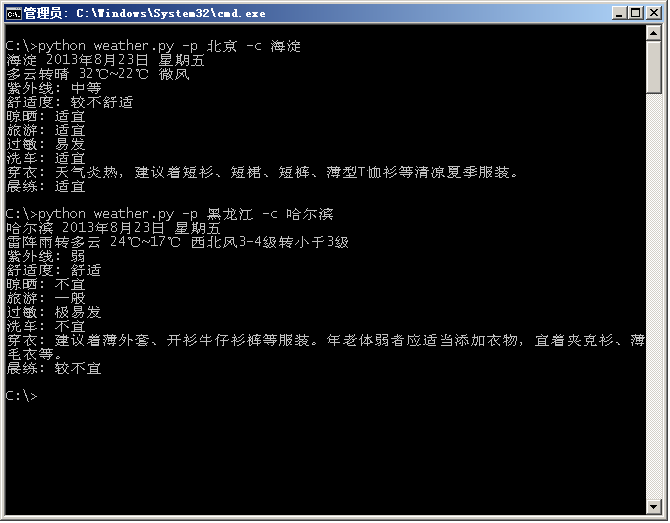

China Weather Forecast
========================

## Introduction ###
the weather forecast from [Weather China](http://www.weather.com.cn/)

## snapshot ##

* --delete delete cache data
* --province province name e.g. 黑龙江
* --city city name e.g. 哈尔滨

## usage ##

<pre>
USAGE:
weather.py [-d|--delete] -p|--province string -c|--city city

	--delete clean cache

	--province province name

	--city city name
</pre>

## develop ##

python

[source](https://github.com/codepongo/CNWeatherForecast)
